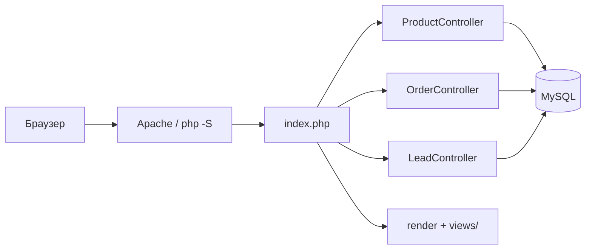

# Листинг программного кода серверной части и схемы БД
## Информационная система «Quattro — платформа домашней мебели»

**Полный итоговый файл:** `docs/листинг-серверная-часть-полный.txt` (PHP + SQL, с нумерацией строк).

**Стек:** PHP 8+, MySQL, PDO, паттерн Front Controller + MVC (упрощённый).

### Часть A. Серверное приложение (PHP)

| № | Файл | Назначение |
|---|------|------------|
| 1 | `index.php` | Точка входа, маршрутизация, заголовки безопасности |
| 2 | `router.php` | Маршрутизатор встроенного сервера PHP (`php -S`) |
| 3 | `.htaccess` | Правила Apache: rewrite, защита каталогов |
| 4 | `config/config.php` | Конфигурация БД, сессий, приложения |
| 5 | `config/Database.php` | Singleton-подключение к MySQL через PDO |
| 6 | `includes/view.php` | Рендеринг представлений через layout |
| 7 | `controllers/ProductController.php` | Каталог, товары, API JSON |
| 8 | `controllers/OrderController.php` | Заказы, CSRF, транзакции |
| 9 | `controllers/LeadController.php` | Заявки на коммерческое предложение |
| 10 | `views/helpers.php` | Серверные хелперы представлений |

### Часть B. Скрипты создания схемы БД (SQL)

| № | Файл | Назначение |
|---|------|------------|
| 11 | `sql/schema.sql` | CREATE DATABASE, основные таблицы (users, categories, products, orders…) |
| 12 | `sql/migrations/001_content_tables.sql` | Таблицы контента: pages, cases, faq, **leads**, site_settings |
| 13 | `sql/migrations/002_alter_products.sql` | Поля `slug`, `series_id` в products |

**Порядок развёртывания:** `schema.sql` → `001` → `002` → остальные миграции `003`…`009` (наполнение данными, см. `sql/migrate.sh`).

---

## 1. index.php

```php
<?php
/**
 * index.php — Единая точка входа (Front Controller)
 */

declare(strict_types=1);

spl_autoload_register(function (string $className): void {
    $prefix   = 'App\\';
    $baseDir  = __DIR__ . '/';

    if (str_starts_with($className, $prefix)) {
        $relative = substr($className, strlen($prefix));
        $parts    = explode('\\', $relative);
        if (isset($parts[0])) {
            $parts[0] = strtolower($parts[0]);
        }
        $file = $baseDir . implode('/', $parts) . '.php';

        if (file_exists($file)) {
            require_once $file;
        }
    }
});

$config = require __DIR__ . '/config/config.php';

header('X-Frame-Options: DENY');
header('X-Content-Type-Options: nosniff');

require_once __DIR__ . '/includes/view.php';

if (!$config['app']['debug']) {
    header('Strict-Transport-Security: max-age=31536000; includeSubDomains');
}

header("Content-Security-Policy: default-src 'self'; style-src 'self' 'unsafe-inline'; script-src 'self'; img-src 'self' data:;");
header('Referrer-Policy: same-origin');

if (session_status() === PHP_SESSION_NONE) {
    $sess = $config['session'];

    session_set_cookie_params([
        'lifetime' => $sess['lifetime'],
        'path'     => '/',
        'domain'   => '',
        'secure'   => $sess['secure'],
        'httponly' => $sess['httponly'],
        'samesite' => $sess['samesite'],
    ]);

    session_start();
}

$allowedLocales   = $config['app']['locales'];
$locale           = $_GET['lang'] ?? $_SESSION['locale'] ?? $config['app']['default_locale'];

if (!in_array($locale, $allowedLocales, true)) {
    $locale = $config['app']['default_locale'];
}
$_SESSION['locale'] = $locale;

$requestUri    = parse_url($_SERVER['REQUEST_URI'] ?? '/', PHP_URL_PATH) ?: '/';
$requestMethod = strtoupper($_SERVER['REQUEST_METHOD'] ?? 'GET');

$scriptDir = str_replace('\\', '/', dirname($_SERVER['SCRIPT_NAME'] ?? ''));
if ($scriptDir !== '/' && $scriptDir !== '' && str_starts_with($requestUri, $scriptDir)) {
    $requestUri = substr($requestUri, strlen($scriptDir)) ?: '/';
}
if ($requestUri === '/index.php') {
    $requestUri = '/';
}
$requestUri = '/' . trim($requestUri, '/');
if ($requestUri !== '/') {
    $requestUri = rtrim($requestUri, '/');
}

$segments = array_values(array_filter(explode('/', $requestUri)));
$section = $segments[0] ?? '';
$param   = $segments[1] ?? '';
$subParam = $segments[2] ?? '';

try {
    if ($requestUri === '/' && $requestMethod === 'GET') {
        $controller = new App\Controllers\ProductController();
        $products   = $controller->getProductsByCategory(0, $locale);
        $categories = $controller->getCategories($locale);
        render('home', [
            'products' => $products,
            'categories' => $categories,
            'pageTitle' => 'Quattro — домашняя мебель',
            'pageDescription' => 'Quattro: стильная домашняя мебель для спальни, гостиной, кухни и домашнего офиса с онлайн-конфигуратором.',
            'bodyClass' => 'page-home',
        ]);
        exit;
    }

    if ($section === 'catalog' && $requestMethod === 'GET') {
        $controller = new App\Controllers\ProductController();

        if ($param === '') {
            $categories = $controller->getCategories($locale);
            $products   = $controller->getProductsByCategory(0, $locale);
            render('catalog/index', [
                'categories' => $categories,
                'products'   => $products,
                'pageTitle' => 'Каталог',
                'pageDescription' => 'Категории домашней мебели Quattro: спальня, гостиная, кухня и другие комнаты.',
                'bodyClass' => 'page-catalog',
            ]);
            exit;
        }

        $categoryId = (int)$param;
        $category   = $controller->getCategoryById($categoryId, $locale);

        if ($category === null) {
            http_response_code(404);
            render('errors/404', ['pageTitle' => '404 — Страница не найдена']);
            exit;
        }

        $products = $controller->getProductsByCategory($categoryId, $locale);
        render('catalog/category', [
            'category' => $category,
            'products' => $products,
            'pageTitle' => $category['name'] . ' — каталог',
            'pageDescription' => 'Каталог товаров категории ' . $category['name'],
            'bodyClass' => 'page-catalog',
        ]);
        exit;
    }

    if ($section === 'product' && $requestMethod === 'GET') {
        $controller = new App\Controllers\ProductController();
        $product    = ctype_digit((string)$param)
            ? $controller->getProductById((int)$param, $locale)
            : $controller->getProductBySlug((string)$param, $locale);

        if ($product === null) {
            http_response_code(404);
            render('errors/404', ['pageTitle' => '404 — Страница не найдена']);
            exit;
        }

        $description = mb_substr(strip_tags($product['description'] ?? ''), 0, 160);
        $allProducts = $controller->getProductsByCategory(0, $locale);
        render('product/card', [
            'product' => $product,
            'configurableProducts' => filter_configurable_products($allProducts),
            'pageTitle' => $product['name'] . ' — Quattro',
            'pageDescription' => $description,
            'bodyClass' => 'page-product',
            'extraCss' => ['/public/css/configurator.css'],
            'extraJs' => ['/public/js/configurator.js'],
        ]);
        exit;
    }

    if ($section === 'api' && $param === 'product' && $requestMethod === 'GET') {
        $productId  = (int)$subParam;
        $controller = new App\Controllers\ProductController();
        $controller->apiGetProduct($productId);
        exit;
    }

    if ($section === 'api' && $param === 'csrf-token' && $requestMethod === 'GET') {
        header('Content-Type: application/json; charset=utf-8');
        $controller = new App\Controllers\OrderController();
        $token      = $controller->generateCsrfToken();
        echo json_encode(['token' => $token], JSON_UNESCAPED_UNICODE);
        exit;
    }

    if ($section === 'api' && $param === 'order' && $subParam === 'create'
        && $requestMethod === 'POST') {
        $controller = new App\Controllers\OrderController();
        $controller->createOrder();
        exit;
    }

    if ($section === 'api' && $param === 'lead' && $subParam === 'create'
        && $requestMethod === 'POST') {
        $controller = new App\Controllers\LeadController();
        $controller->createLead();
        exit;
    }

    if ($section === 'order' && $param === 'success' && $requestMethod === 'GET') {
        $orderId    = (int)$subParam;
        $controller = new App\Controllers\OrderController();
        $controller->showSuccess($orderId);
        exit;
    }

    if ($section === 'privacy' && $requestMethod === 'GET') {
        render('pages/privacy', [
            'pageTitle' => 'Политика конфиденциальности — Quattro',
            'pageDescription' => 'Как Quattro обрабатывает персональные данные в формах заявки и заказа.',
            'bodyClass' => 'page-privacy',
        ]);
        exit;
    }

    if ($section === 'cart' && $requestMethod === 'GET') {
        render('cart', [
            'pageTitle' => 'Корзина — Quattro',
            'pageDescription' => 'Оформление заказа через конфигуратор Quattro.',
            'bodyClass' => 'page-cart',
        ]);
        exit;
    }

    http_response_code(404);
    render('errors/404', ['pageTitle' => '404 — Страница не найдена']);

} catch (Throwable $e) {
    if ($config['app']['debug']) {
        http_response_code(500);
        echo '<pre style="background:#1a1d27;color:#ef4444;padding:20px;font-family:monospace;">';
        echo '<strong>Ошибка:</strong> ' . htmlspecialchars($e->getMessage()) . "\n\n";
        echo '<strong>Файл:</strong> '   . htmlspecialchars($e->getFile()) . ':' . $e->getLine() . "\n\n";
        echo '<strong>Трассировка:</strong>' . "\n" . htmlspecialchars($e->getTraceAsString());
        echo '</pre>';
    } else {
        error_log('[' . date('Y-m-d H:i:s') . '] ' . $e->getMessage() . ' in ' . $e->getFile() . ':' . $e->getLine());
        http_response_code(500);
        render('errors/500', ['pageTitle' => '500 — Ошибка сервера']);
    }
}
```

*Полная версия с комментариями: см. файл `index.php` в корне проекта (311 строк).*

---

## Итоговый файл

Все модули **1–13** (PHP + SQL) собраны в **`docs/листинг-серверная-часть-полный.txt`** (~2 740 строк с нумерацией).

**Объём:** PHP ~2 150 строк + SQL ~525 строк (schema + миграции 001–002).

---

## API серверной части (краткая справка для пояснительной записки)

| Метод | URL | Обработчик |
|-------|-----|------------|
| GET | `/` | Главная, `ProductController` |
| GET | `/catalog`, `/catalog/{id}` | Каталог |
| GET | `/product/{id\|slug}` | Карточка товара |
| GET | `/api/product/{id}` | JSON товара |
| GET | `/api/csrf-token` | CSRF-токен |
| POST | `/api/order/create` | Создание заказа |
| POST | `/api/lead/create` | Заявка на КП |
| GET | `/order/success/{id}` | Подтверждение заказа |

---

## Схема взаимодействия (для раздела «Архитектура»)



---

*Документ сгенерирован для дипломного приложения. Актуальный код — в каталогах `config/`, `controllers/`, `includes/`, корне проекта.*
